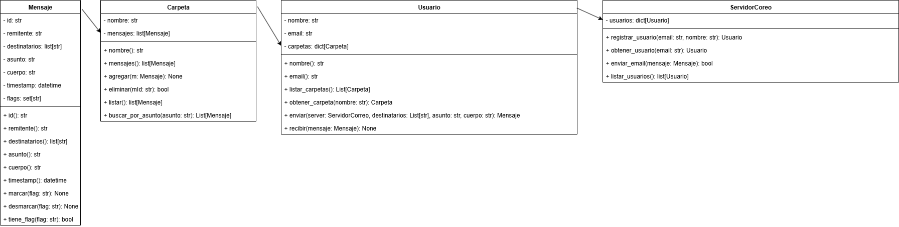

# Trabajo Final — Entrega 1: Cliente de Correo Electrónico (Modelado y Encapsulamiento)

Documento con: diseño de clases, diagrama de clases, justificación de decisiones y una implementación en Python de las clases principales:

* `Usuario`
* `Mensaje`
* `Carpeta`
* `ServidorCorreo`

La implementación usa encapsulamiento (atributos privados, propiedades, métodos de acceso) e interfaces para enviar, recibir y listar mensajes. Al final hay ejemplos de uso y pruebas básicas.

-------------------------------------------------------------------------------------------

## Diagrama de clases 

1. **Encapsulamiento**: todos los atributos de las clases principales están precedidos por `_` y se exponen mediante propiedades o métodos públicos para controlar validaciones y mantener invariantes.
2. **Separación de responsabilidades**: `ServidorCorreo` se encarga de la lógica de entrega y registro de usuarios; `Usuario` maneja la interfaz hacia el usuario (crear carpetas, enviar mails); `Carpeta` contiene mensajes y provee búsquedas; `Mensaje` representa el contenido con metadatos.
3. **Interfaces simples y testables**: los métodos `enviar`, `registrar_usuario`, `enviar_email`, `agregar`, `listar` permiten pruebas unitarias y facilitan extender el sistema (por ejemplo, añadir filtros o colas de entrega).
4. **Extensibilidad**: se puede añadir más adelante: filtros automáticos, reglas por carpeta, reintentos, persistencia (serialización), protocolos (IMAP/SMTP simulados).